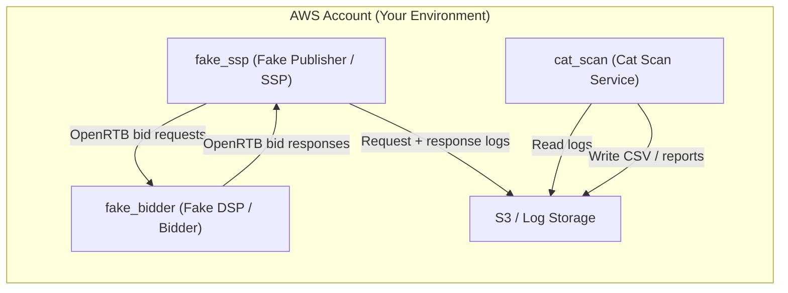

<p align="center">
  
</p>

<h1 align="center">🐱 Cat Scan – RTB Path Explorer</h1>

<p align="center">
  <strong>RTB Fabric POC</strong>
</p>

<p align="center">
  
  
  
</p>

---

**Cat Scan** is an open‑source playground for understanding what's really happening on a single RTB supply path.

We simulate a publisher like **Truecaller**, a simple **fake bidder**, and a **Cat Scan service** that reads bid request/response logs and produces **human‑friendly reports**:

- Which ad formats you keep **listening to but never bid on**
- Where you're hurting yourself (timeouts, below‑floor bids, invalid responses)
- Simple **publisher‑specific labels** (e.g. placement segments) that make optimisation easier

The long‑term goal is to make this logic easy to run **inside your own AWS account**, and eventually as an **AWS RTB Fabric module**, while keeping all production data private to the user.

> 💡 *"Cat Scan" – because it helps you see inside your RTB traffic, just like a medical scan.*

---

## 📐 High‑Level Architecture



> Later, we can insert **AWS RTB Fabric gateways/links** between `fake_ssp` and `fake_bidder` and point Cat Scan at **Fabric‑produced logs** instead of our own.

---

## 🎯 Project Goals

- Provide a **realistic but safe** RTB playground using synthetic traffic
- Give buyers/engineers **better diagnostics** than typical SSP dashboards:
  - Format waste (listening vs bidding)
  - Timeouts, below‑floor bids, invalid responses
  - Simple per‑publisher segment views
- Ship everything as **open source**, deployable into **your own AWS account**
- Keep all sensitive data **in your environment** – no external service needed

---

## What you need to get started:

### Local Development (Available Now)
1. **Rust** (latest stable) – for building the services
2. **Cargo** – comes with Rust
3. That's it! Run all three services locally.

### AWS Deployment (Coming Soon)
1. You have RTB Fabric set up and are receiving traffic (optional for testing)
2. You know which **region** your Fabric stack is in (e.g. `eu-west-1`)
3. You have IAM rights to create CloudFormation stacks, ECS tasks, S3 buckets
4. You already have Fabric writing logs into an S3 bucket, OR can set up S3 for this


## 🧩 Components

### 1. `fake_ssp` (Fake Publisher / SSP)

<details>
<summary>Click to expand</summary>

- Simulates a publisher like Truecaller sending **OpenRTB 2.5** bid requests
- Generates configurable traffic:
  - Different banner sizes (e.g. 300×250, 320×50, 160×600)
  - Different bidfloors
  - Different placement IDs / tag IDs (e.g. `inbox_top`, `missed_call`, etc.)
- Sends requests to the `fake_bidder` `/bid` endpoint
- Logs each **request + response + timestamps** to a log stream (initially local file, then S3)

</details>

### 2. `fake_bidder` (Fake DSP / Bidder)

<details>
<summary>Click to expand</summary>

- Minimal HTTP service that:
  - Accepts POST `/bid` with an `OpenRtbBidRequest`
  - Applies simple rules to decide whether to bid and at what price
  - Returns an `OpenRtbBidResponse` or a no‑bid
- Behaviours we simulate:
  - Always/sometimes/never bidding on certain **formats**
  - Occasionally **sleeping** before responding to simulate **timeouts**
  - Pricing relative to `bidfloor` to test below‑floor detection

</details>

### 3. `cat_scan` (Cat Scan Service)

<details>
<summary>Click to expand</summary>

- CLI / service that reads **request/response pairs** from logs
- Computes aggregate stats:

  - **Format listening vs bidding**  
    - `requests_per_format`  
    - `bids_per_format`  
    - `bid_rate` per `(width, height, type)`

  - **Self‑inflicted issues**  
    - Timeouts (responses arriving after a threshold or missing)  
    - Below‑floor bids (`bid.price < bidfloor`)  
    - Invalid responses (parse / protocol errors)

  - **Publisher‑specific segments**  
    - Map `tagid` → `pub_segment` (e.g. `Truecaller_Inbox_Top`)  
    - Compute same stats per `pub_segment`

- Writes **CSV / Parquet** summaries back to S3:
  - `format_stats.*`
  - `segment_stats.*`

</details>

---

## 🔄 Data Flow

```
┌─────────────┐    OpenRTB     ┌──────────────┐
│  fake_ssp   │ ────────────▶  │ fake_bidder  │
│             │ ◀────────────  │              │
└──────┬──────┘   bid/no-bid   └──────────────┘
       │
       │  logs (request + response + timing)
       ▼
┌─────────────┐
│    Logs     │  (JSONL / S3)
└──────┬──────┘
       │
       ▼
┌─────────────┐    CSV/Parquet   ┌─────────────┐
│  cat_scan   │ ───────────────▶ │   Reports   │
└─────────────┘                  └─────────────┘
```

1. `fake_ssp` generates synthetic **OpenRTB** requests and sends them to `fake_bidder`
2. `fake_bidder` responds with bids or no‑bids according to simple logic
3. `fake_ssp` logs **both sides** (request + response + timing) to logs
4. `cat_scan` reads logs and produces:
   - "Formats you listen to but never bid on"
   - "Timeouts and below‑floor events per format / segment"
   - Simple per‑publisher segment summaries

In the first iteration, logs are **local JSONL files**.
In AWS, logs will be stored in **S3** (or Kinesis → S3), and Cat Scan will run as an ECS/Fargate task.

---

## 🚀 Usage

### Quick Start (Local)

```bash
# 1. Run the fake bidder (Terminal 1)
cargo run -p fake_bidder

# 2. Run the fake SSP to generate traffic (Terminal 2)
cargo run -p fake_ssp

# 3. Analyze the logs and generate reports (Terminal 3)
cargo run -p cat_scan -- fake_ssp_logs.jsonl --out ./reports

# 4. Open the report
open reports/report.html
```

### Cat Scan CLI Options

```bash
# Basic usage - output to directory with CSV + HTML
cargo run -p cat_scan -- logs.jsonl --out ./reports

# Read directly from S3 (requires AWS credentials)
cargo run -p cat_scan -- s3://bucket/logs.jsonl --out ./reports

# Filter to formats with at least 100 requests
cargo run -p cat_scan -- logs.jsonl --min-requests 100 --out ./reports

# Sort by bid rate (descending)
cargo run -p cat_scan -- logs.jsonl --sort-by bid_rate --out ./reports

# Legacy: Generate HTML to specific path
cargo run -p cat_scan -- logs.jsonl --html-out report.html

# Show per-publisher and per-segment stats (also in HTML)
cargo run -p cat_scan -- logs.jsonl --segment-stats --out ./reports

# Combine options
cargo run -p cat_scan -- s3://bucket/logs.jsonl \
  --min-requests 50 \
  --sort-by requests \
  --segment-stats \
  --out ./reports
```

### CLI Options

| Option | Description |
|:-------|:------------|
| `--out DIR` | Output directory for CSV files and HTML report (recommended) |
| `--min-requests N` | Only show formats with at least N requests |
| `--sort-by format\|requests\|bid_rate` | Sort output by format (default), requests (desc), or bid_rate (desc) |
| `--html-out PATH` | Generate HTML report at specific path (deprecated, use --out) |
| `--segment-stats` | Show per-publisher and per-segment stats in report and stderr |
| `--time-analysis` | Show bid rate trends bucketed by minute (stderr output) |

### Output Files

When using `--out ./reports`, Cat Scan generates:

**format_stats.csv** - Format-level statistics:
| Field | Description |
|:------|:------------|
| `w,h` | Banner dimensions (canonical IAB sizes) |
| `requests` | Total bid requests received |
| `bids` | Number of bids placed |
| `bid_rate` | Percentage of requests that received a bid |
| `avg_bid_price` | Average price when bidding |

**segment_stats.csv** - Publisher and segment breakdowns

**report.html** - Interactive HTML report with:
- Sortable format table with filtering controls
- Multi-publisher view (tabs)
- Segment analysis
- SSP breakdown
- Problem format detection (zero bids, non-standard sizes, low bid rates)

---

## 📦 Deployment

### Prerequisites

- **Rust** (latest stable) – for building the services
- **Docker** – for containerisation
- **AWS CLI** – configured with appropriate credentials
- **Terraform** or **AWS CDK** (optional) – for infrastructure automation

### Local Deployment

```bash
# Clone the repository
git clone https://github.com/your-org/cat-scan.git
cd cat-scan

# Build all services
cargo build --release

# Run the fake SSP (generates traffic)
cargo run -p fake_ssp --release

# Run the fake bidder (responds to bids)
cargo run -p fake_bidder --release

# Analyse the logs
cargo run -p cat_scan --release -- logs.jsonl --html-out report.html
```

### Docker Deployment

#### Using Docker Compose (Recommended)

```bash
# Start the fake bidder and fake SSP
docker-compose up fake_bidder fake_ssp

# Wait for logs to be generated in ./logs/fake_ssp_logs.jsonl
# Then analyze the logs (in another terminal)
docker-compose run --rm cat_scan /logs/fake_ssp_logs.jsonl --out /reports

# View the report
open reports/report.html

# Clean up
docker-compose down
```

#### Building Individual Images

```bash
# Build all images
docker build -t cat-scan/fake_bidder -f fake_bidder/Dockerfile .
docker build -t cat-scan/fake_ssp -f fake_ssp/Dockerfile .
docker build -t cat-scan/cat_scan -f cat_scan/Dockerfile .

# Run individually
docker run -p 3000:3000 cat-scan/fake_bidder
docker run -v $(pwd)/logs:/logs cat-scan/fake_ssp
docker run -v $(pwd)/logs:/logs -v $(pwd)/reports:/reports cat-scan/cat_scan /logs/fake_ssp_logs.jsonl --out /reports
```

### AWS Deployment (ECS Fargate)

**Status:** CloudFormation templates ready. Modular nested stack architecture.

See `fake_bidder/DEPLOY.md` for manual deployment steps.

#### CloudFormation Deployment

The infrastructure is defined as modular nested stacks in `infra/cloudformation/`:

```
infra/cloudformation/
├── main.yaml              # Orchestrator (deploy this)
└── modules/
    ├── network.yaml       # VPC, subnets, security groups
    ├── storage.yaml       # ECR repos, S3 buckets
    ├── compute.yaml       # ECS cluster, task definitions, IAM
    └── scheduling.yaml    # EventBridge rules
```

**Deploy:**

```bash
# 1. Upload module templates to S3
aws s3 cp infra/cloudformation/modules/ s3://your-templates-bucket/cloudformation/modules/ --recursive

# 2. Deploy the main stack
aws cloudformation create-stack \
  --stack-name cat-scan \
  --template-body file://infra/cloudformation/main.yaml \
  --parameters \
    ParameterKey=TemplatesBucketName,ParameterValue=your-templates-bucket \
    ParameterKey=LogBucketName,ParameterValue=your-rtb-logs-bucket \
    ParameterKey=ReportBucketName,ParameterValue=your-reports-bucket \
  --capabilities CAPABILITY_NAMED_IAM

# 3. Build and push Docker images to ECR (after stack creates repos)
# See stack outputs for ECR repository URIs
```

**Using existing VPC:**

```bash
aws cloudformation create-stack \
  --stack-name cat-scan \
  --template-body file://infra/cloudformation/main.yaml \
  --parameters \
    ParameterKey=CreateVPC,ParameterValue=false \
    ParameterKey=ExistingVpcId,ParameterValue=vpc-xxx \
    ParameterKey=ExistingSubnetIds,ParameterValue="subnet-aaa,subnet-bbb" \
    ParameterKey=ExistingSecurityGroupId,ParameterValue=sg-xxx \
    ParameterKey=TemplatesBucketName,ParameterValue=your-templates-bucket \
    ParameterKey=LogBucketName,ParameterValue=your-rtb-logs-bucket \
    ParameterKey=ReportBucketName,ParameterValue=your-reports-bucket \
  --capabilities CAPABILITY_NAMED_IAM
```

### Environment Variables

**fake_ssp:**
- `BIDDER_ENDPOINT` – URL of the fake bidder (default: `http://127.0.0.1:3000/bid`)
- `LOG_DESTINATION` – `local` or `s3` (default: `local`)
- `LOG_FILE` – Path to log file when using local (default: `fake_ssp_logs.jsonl`)
- `S3_BUCKET` – S3 bucket name when using s3 destination (required for s3)
- `S3_PREFIX` – S3 prefix for log files (optional)

**cat_scan:**
- `AWS_PROFILE` / `AWS_REGION` – For S3 access when using `s3://` URIs

---

## 🛠 Tech Stack (POC)

| Category | Technology |
|:---------|:-----------|
| **Language** | Rust |
| **HTTP Server** | `axum` or `warp` |
| **Serialization** | `serde`, `serde_json` |
| **OpenRTB** | Minimal custom structs (just the fields we need) |
| **Local Storage** | JSONL files |
| **Cloud Storage** | S3 buckets (later Kinesis/MSK → S3) |
| **Compute** | ECS Fargate (EKS optional) |
| **IaC** | CloudFormation (modular nested stacks) |

---

## 📅 Development Phases

| Phase | Description | Status |
|:------|:------------|:------:|
| **1. Local POC** | Implement `fake_ssp`, `fake_bidder`, `cat_scan` as Rust services. Use JSONL log files. Multi-publisher HTML reports. S3 read support. Segment analysis. Problem detection. Unit tests. | ✅ |
| **2. AWS POC** | Containerise all services (Docker + docker-compose). Deploy to ECS Fargate. S3 log writing. CloudFormation template. Scheduled Cat Scan runs. | ✅ Ready to deploy |
| **3. RTB Fabric** | Add Fabric gateways between SSP/bidder. Use Fabric‑produced logs. Refactor Cat Scan into a Fabric module. | 🎯 Future |

---

## 🔒 Privacy & Ownership

- All services and logs are intended to run **inside your own AWS account**
- The project does **not** require:
  - sending traffic to external vendors
  - sharing logs outside your environment
- You can:
  - run the code as‑is,
  - fork it,
  - customise it to your environment and publishers

---

## 📊 Status

| Milestone | Status |
|:----------|:------:|
| Architecture & goals defined | ✅ |
| `fake_ssp` and `fake_bidder` implemented | ✅ |
| `cat_scan` CLI with format stats, S3 read support, HTML reports | ✅ |
| Multi-publisher reports with tabs | ✅ |
| Segment and SSP analysis | ✅ |
| Problem format detection | ✅ |
| Unit tests for core aggregation logic | ✅ |
| Canonical size bucketing (IAB standards) | ✅ |
| Docker for fake_bidder | ✅ |
| Docker for fake_ssp and cat_scan | ✅ |
| docker-compose for local development | ✅ |
| CloudFormation template for AWS deployment | ✅ |
| S3 log writing (fake_ssp) | ✅ |
| Scheduled Cat Scan runs in AWS | ✅ (template ready) |
| RTB Fabric integration | 🎯 |

---

<p align="center">
  <strong>Long‑term goal:</strong> Make it easy for any buyer to drop Cat Scan into their RTB Fabric setup and finally get a clearer picture of what's happening on a single supply path.
</p>

<p align="center">
  Made with 🐱 by https://rtb.cat
</p>